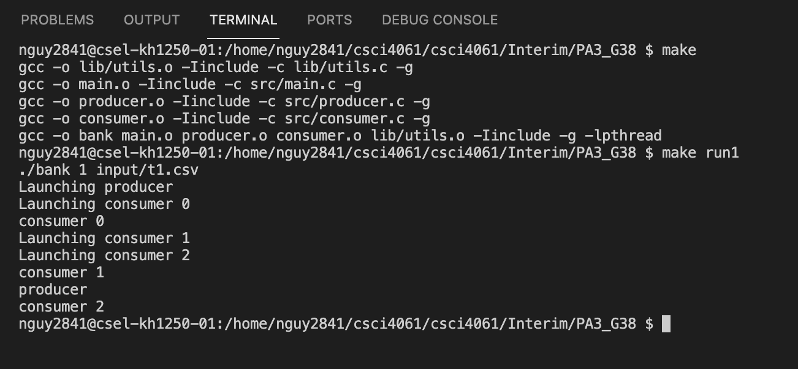

# Project #3 – Multithreading

* Group 38
* Amy Nguyen - nguy2841
* Conor Hogan - hogan386
* Turner Gravin - gravi022

* Members’ individual contribution plans:
  * Amy - Main thread results and log printing, assets change of bank, help with consumer.c
  * Conor - Consumer threads queue checking, parsing, and calculations
  * Turner - Main thread initializations and argument passing, and set up of shared queue with producer thread

