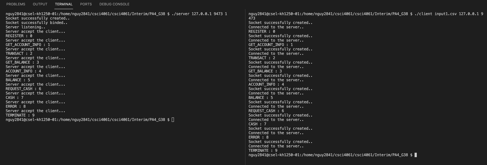

# Project #4 - Network Sockets
* Group 38
* Amy Nguyen - nguy2841
* Conor Hogan - hogan386
* Turner Gravin - gravi022

* Members’ individual contribution plans:
  * Amy - server query parsing, server log, client read from file and send to server, client timer
  * Conor - server query replies and signaling of log thread’s condition variable, termination
  * Turner - set up of server/client communication, set up threads, global balance

* Instructions on compiling and running

## Compile
	> make clean
	> make

## Execution
	> make run1

  (OR WITH TWO TERMINALS: 
    > ./server 127.0.0.1 9473 1
    > ./client input1.csv 127.0.0.1 9473
  )

